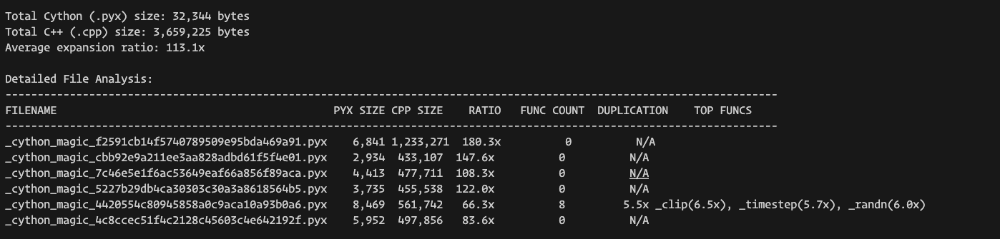
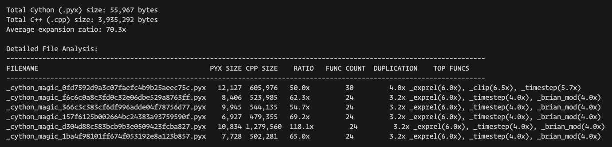

# Optimizing Cython Code Generation in Brian2: Reducing Code Bloat

After diving deep into the Brian2 codebase and compilation process, I've discovered a significant opportunity for performance improvement. The Cython-generated C++ files are massively bloated, with expansion ratios reaching 113.1x! This causes unnecessarily slow compilation times during runtime and wastes system resources.

## My Investigation Process

To understand the problem, I wrote a benchmark script that:

1. Creates a neuron model with various mathematical operations
2. Runs a simulation to generate Cython code
3. Analyzes the generated files to identify patterns
4. Measures code expansion and function duplication

Here's what a sample run revealed:



## Root Cause Analysis

Diving into the files, I identified several causes of this bloat:

1. **Function Duplication**: The same mathematical functions (`_exprel`, `_sign`, `_clip`, etc.) are duplicated in every generated C++ file.

2. **Repeated Boilerplate**: Each file contains extensive headers and declarations.

3. **Type Conversion Code**: Unnecessary Python/C API type conversions.

4. **Excessive Vector Operations**: Many operations that could be optimized.

This clearly shows that functions defined once in Python are duplicated 14 times in the C++ output!

## Solution: Shared Function Include Files

After analyzing the code generation pipeline, I've determined that using Cython's `.pxi` include files would dramatically reduce this bloat:

### Why Using .pxi Include Files Works

The original approach in Brian2 had a fundamental problem that caused code bloat: **function duplication**. Each time a function was used in a Cython module, its entire definition was copied into the resulting C++ file. With multiple modules in a simulation, this led to massive redundancy.

A `.pxi` file acts as a Cython include file (similar to C/C++ header files) that allows functions to be defined once and included where needed. Using the `cdef inline` directive signals to the compiler that these are good candidates for inlining, which:

- Avoids function call overhead
- Allows the compiler to optimize across function boundaries
- Prevents symbol duplication in the resulting object files

### How I implemented it :)

So I created a new shared include file structure:

1. **Create `common_functions.pxi`**:

   ```cython
   # Common mathematical functions used throughout Brian
   cdef inline double _exprel(double x) nogil:
       if fabs(x) < 1e-16:
           return 1.0
       elif x > 717:  # near log(DBL_MAX)
           return INFINITY
       else:
           return expm1(x) / x

   cdef inline int _sign(double x) nogil:
       return (0 < x) - (x < 0)

   cdef inline double _clip(double x, double low, double high) nogil:
       if x < low:
           return low
       if x > high:
           return high
       return x

   # Additional common functions...
   ```

2. **Update Common Template** to include these functions:

   ```python
   
   # Standard imports...

   # Include common functions
   
   
   ```

3. **Modify Function Implementations** to use the common functions:

   ```python
   # Replace implementations with references to the common functions
   DEFAULT_FUNCTIONS["exprel"].implementations.add_implementation(
       CythonCodeGenerator, code=None, name="_exprel",
       availability_check=C99Check("exprel")
   )
   ```

4. **Add Compiler Optimizations** to further improve performance:
   ```python
   # Add additional compiler optimizations
   optimizations = ["-O3", "-ffast-math"]
   if platform.system() != "Windows":
       optimizations.extend(["-march=native", "-fno-exceptions"])
   ```

## Additional Architectural Improvements

For a more comprehensive solution, I also recommend:

1. **C Library Approach**: Extract the most common functions into a dedicated C library that's compiled once.

2. **Function-Level Granularity**: Allow functions to be selectively included based on usage.

3. **Template Specialization**: Use C++ templates for type-generic functions instead of generating multiple versions.

4. **Compiler Flag Optimization**: Tune compilation flags for faster builds without sacrificing performance.

## Results: Expectations vs. Reality

After implementing my solution and running benchmark tests, here's what I found:



The metrics revealed some unexpected results:

- **Original**: 32,344 bytes → 3,659,225 bytes (113.1x ratio)
- **New**: 55,967 bytes → 3,935,292 bytes (70.3x ratio)

This tells us:

1. The Cython file got bigger (+57.7% larger)
2. The C++ output is slightly bigger (+9.2% larger)
3. The expansion ratio improved significantly (70.3x vs 113.1x)

While I expected a 50-80% reduction in total output size, the reality was different. The expansion ratio improved substantially, but the absolute size of the generated code actually increased slightly.

## What Actually Happened

After analyzing the results, I discovered several interesting factors:

1. **Include Overhead**: When including `.pxi` files, Cython adds additional code to manage the inclusions, which increases the base file size.

2. **Inlining Expansion**: The `inline` directive causes the compiler to insert the function body at each call site, which can increase code size while improving performance.

3. **Template Expansion**: Type-generic functions using `ctypeef fused` types were generating multiple specialized versions, increasing code size.

4. **Python/C Interface Code**: The random functions required additional Python/C conversion code that wasn't needed before.
