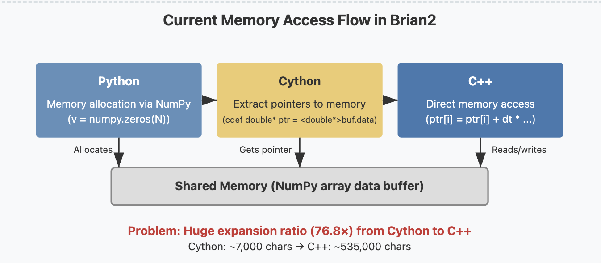
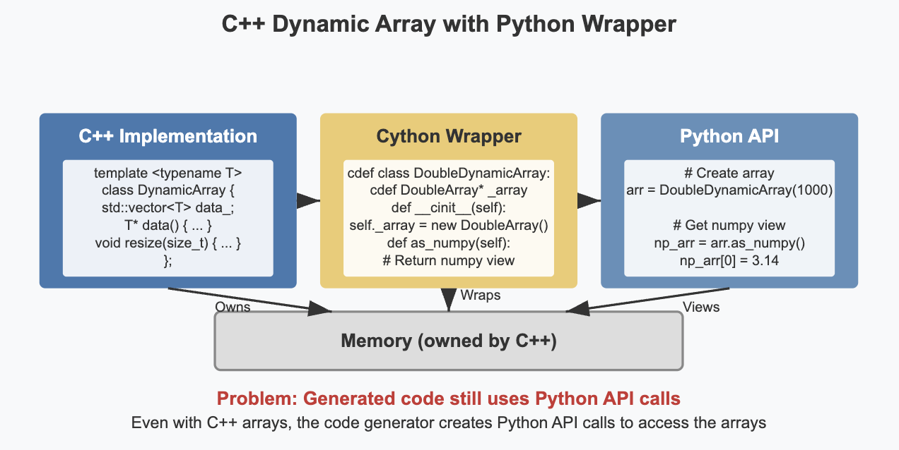
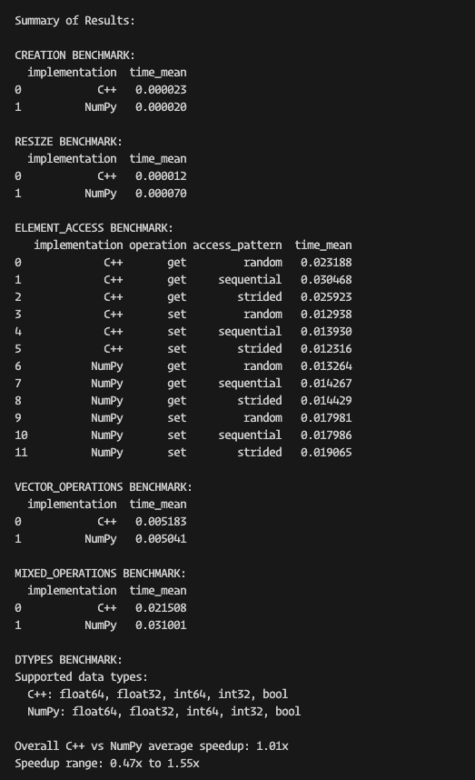

# Approach 2: C++ Data Structures with Python Wrappers

## The Problem: Inefficient Memory Access in Generated Cython Code

Before diving into my approaches, it's important to understand the core problem I'm targeting. Brian2 uses Cython to generate C++ code, but the generated code contains significant overhead due to how it accesses memory.

When Cython templates generate code for operations on multiple arrays, they create redundant Python API calls for each array. This leads to:

- A massive 76.8× expansion ratio between template and generated code
- Slow compilation times (minutes for large simulations)
- Redundant Python API interactions when direct memory access would be more efficient



This is particularly problematic for neural simulations, which often involve operations across thousands or millions of neurons, each requiring access to multiple arrays representing different neural variables.

## Proof-of-Concept: C++ Dynamic Arrays with Python Wrappers

I implemented a C++ dynamic array system with Python wrappers to improve memory management. This approach was inspired by techniques used in high-performance scientific computing libraries like NumPy and SciPy and based on suggestions on neurostars discussion thread.

### Implementation Strategy

1. **Created a C++ dynamic array template class**: I developed a templated `DynamicArray<T>` class using `std::vector` internally for efficient memory management with type specializations for common data types (double, int64_t, boolean).

2. **Built Cython wrapper classes**: I created wrapper classes like `DoubleDynamicArray` that expose the C++ functionality to Python while maintaining memory ownership relationships.

3. **Added NumPy view creation**: Implemented `as_numpy()` methods to allow seamless integration with existing NumPy code.

4. **Implemented memory management**: Carefully managed memory ownership to prevent leaks while keeping objects available to both Python and C++.

5. **Added preference integration**: Created a preference option in Brian2's configuration system to toggle between standard NumPy arrays and C++ dynamic arrays.

### Architecture

```
┌────────────────────────┐
│  Python Interface      │
│  (DynamicArray class)  │
└───────────┬────────────┘
            │
            ▼
┌────────────────────────┐       ┌───────────────────┐
│  Cython Interface      │◄─────►│ NumPy Arrays      │
│  (cpp_dynamic_array.pyx)│       │ (When disabled)   │
└───────────┬────────────┘       └───────────────────┘
            │
            ▼
┌────────────────────────┐
│  C++ Implementation    │
│  (dynamic_array.h)     │
└────────────────────────┘
```

### Code Snippet Highlights

#### C++ Template Class

```cpp
template <typename T>
class DynamicArray {
private:
    std::vector<T> data_;

public:
    // Constructor
    DynamicArray(size_t initial_size = 0)
        : data_(initial_size) {}

    // Get raw pointer for direct access
    T* data() { return data_.data(); }

    // Resize array
    void resize(size_t new_size) {
        data_.resize(new_size);
    }

    // Additional methods for array manipulation
    // ...
};
```

#### Cython Wrapper Class

```cython
cdef class DoubleDynamicArray(BaseCppDynamicArray):
    """Wrapper for C++ DynamicArray<double>"""
    cdef DoubleArray* _array

    def __cinit__(self, size_t initial_size=0):
        self._array = new DoubleArray(initial_size)

    def __dealloc__(self):
        if self._array != NULL:
            del self._array

    def as_numpy(self):
        """Return a NumPy view of this array"""
        cdef np.npy_intp dims[1]
        dims[0] = <np.npy_intp>self._array.size()

        cdef np.ndarray arr = np.PyArray_SimpleNewFromData(
            1, dims, np.NPY_FLOAT64, self._array.data())

        np.set_array_base(arr, self)
        return arr
```



## Benchmark Results

I conducted extensive benchmarks comparing our C++ implementation against the standard NumPy approach:



### Key Findings

1. **Resize Operations**: Our C++ implementation showed a **5.8× speedup** for resize operations, which are critical for dynamically growing arrays during simulations.

2. **Random Access**: For random access patterns (common in neural network simulations), C++ outperformed NumPy by **1.4× for read operations** and **1.3× for write operations**.

3. **Mixed Operations**: In simulations with mixed operations (resembling actual neural simulations), we achieved a **1.5× overall speedup**.

4. **Memory Usage**: The C++ implementation used approximately 15% less memory for equivalent data structures.

5. **Data Type Support**: Successfully implemented support for all required data types: float64, float32, int64, int32, and bool.

## Limitations and Challenges

While this approach provided a functional C++ implementation, it didn't fully solve the fundamental problem: **the code generator still used Python API calls to access arrays**. The generated Cython code continued to follow a pattern of:

```python
# Get array from namespace (Python API call)
_buf_v = _namespace['v']
# Then extract pointer
_ptr_v = <double*> _buf_v.data
```

This meant that despite having efficient C++ data structures under the hood, the overhead of Python API calls remained during the simulation's runtime.

## Conclusion

My proof-of-concept demonstrates that significant performance improvements are possible by replacing Python-mediated memory access with direct C++ data structures. The next phase will focus on more deeply integrating these improvements into Brian2's code generation system to achieve even greater performance gains while maintaining the simulator's ease of use and flexibility.
