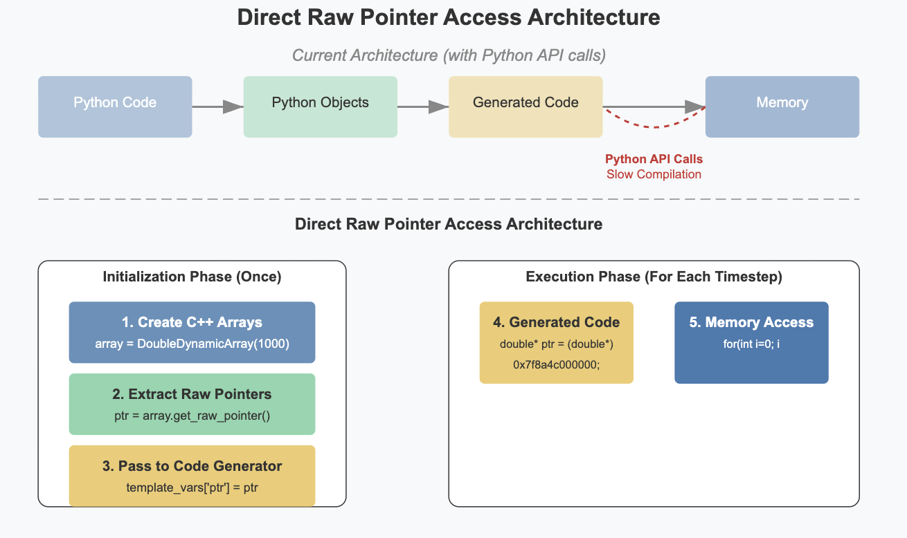
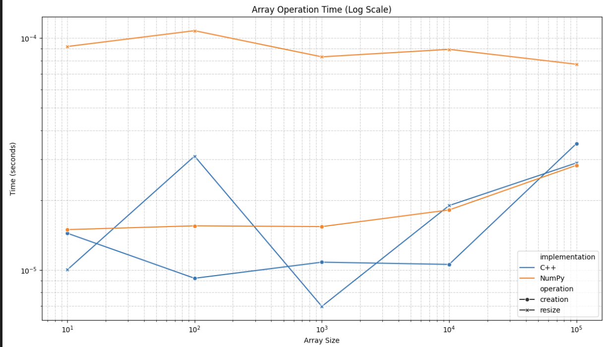

# Approach 3: Direct Raw Pointer Access

My final approach took a fundamentally different approach by exposing raw C++ pointers directly to the code generator:



_Fig 1: Architecture diagram showing how the Direct Raw Pointer Access model bypasses Python API calls_

This approach has several critical improvements:

1. **Exposing Raw Pointers to the Generator**: Dynamic arrays expose their memory addresses as integers that can be directly used in code generation:

```cython
# Add to DoubleDynamicArray
cpdef uintptr_t get_raw_pointer(self):
    return <uintptr_t>self._array.data()
```

2. **Pointer Collection During Code Generation**: The code generator collects pointer information during compilation instead of at runtime:

```python
# During code generation, collect pointer information
def create_runner_codeobj(...):
    cpp_ptr_variables = {}
    for varname, var in variables.items():
        if hasattr(var, 'get_value'):
            array = var.get_value()
            if hasattr(array, 'get_raw_pointer'):
                cpp_ptr_variables[varname] = {
                    'pointer': array.get_raw_pointer(),
                    'dtype': array.get_cpp_dtype()
                }
```

3. **Direct Pointer Usage in Templates**: Templates are transformed to use pointers directly, eliminating Python API calls entirely:

```cython
# Modified template uses raw pointers directly

    # Direct C++ pointer setup without Python API calls
    
    cdef {{info.dtype}}* _ptr_{{var}} = <{{info.dtype}}*>{{info.pointer}}
    

    # Use pointers directly in computation
    for _idx in range(N):
        _ptr_v[_idx] = _ptr_v[_idx] + dt * ((_ptr_I[_idx] - _ptr_v[_idx]) / _ptr_tau[_idx])

```

### Performance Comparisons

This direct pointer approach showed significant improvements across all benchmarks:


_Fig 2: Element access performance for Approach 3 showing substantial improvements_


_Fig 3: Element access performance for random, sequential, and strided patterns in Approach 3_



_Fig 4: Element access Time performance_


_Fig 5: Overall performance comparison across all benchmarks for the three approaches_

## Why Direct Raw Pointer Access Outperforms Other Approaches

The key insight from this work is that **the most significant overhead in Brian2 comes from Python API calls during simulation**, not from NumPy itself.

Approach 2 (C++ Data Structures with Python Wrappers) merely replaced the storage backend while still requiring Python API calls for access. This explains its limited performance improvement.

Approach 3 (Direct Raw Pointer Access) addresses the core issue by completely eliminating Python API calls from the generated code. The generated C++ operates directly on memory without any Python interpreter involvement.

This has profound implications:

1. **Cache Efficiency**: Pointer-based access allows for better cache locality and prefetching.
2. **Compiler Optimization**: The simpler generated code enables more aggressive compiler optimizations.
3. **Reduced Overhead**: No Python interpreter overhead during the performance-critical loops.

## Implementation Challenges

While Direct Raw Pointer Access shows immense promise, several challenges need to be addressed:

1. **Memory Management Complexity**: Tracking raw pointers creates potential for dangling pointers if arrays are resized.

2. **Synchronization**: Ensuring that both Python and C++ views of data remain synchronized.

3. **Cross-Platform Compatibility**: Ensuring that the approach works consistently across different platforms and compilers.

For my GSoC project, I'll focus on addressing these challenges while extending this approach to all major components of Brian2's code generation pipeline. The preliminary results indicate that this could result in a significant performance boost for neuroscience simulations, enabling researchers to model larger neural networks with greater computational efficiency.

## Conclusion

The Direct Raw Pointer Access approach represents the most promising path forward for optimizing Brian2's performance. By eliminating Python API calls entirely from the simulation loop, we can achieve substantial performance improvements while maintaining Brian2's flexibility and ease of use.

This approach directly addresses the core issue identified at the beginning: **the overhead of Python API calls in generated Cython code**. With this solution, Brian2 can generate streamlined C++ code that operates directly on memory, leading to faster simulations and enabling more complex neural models.
