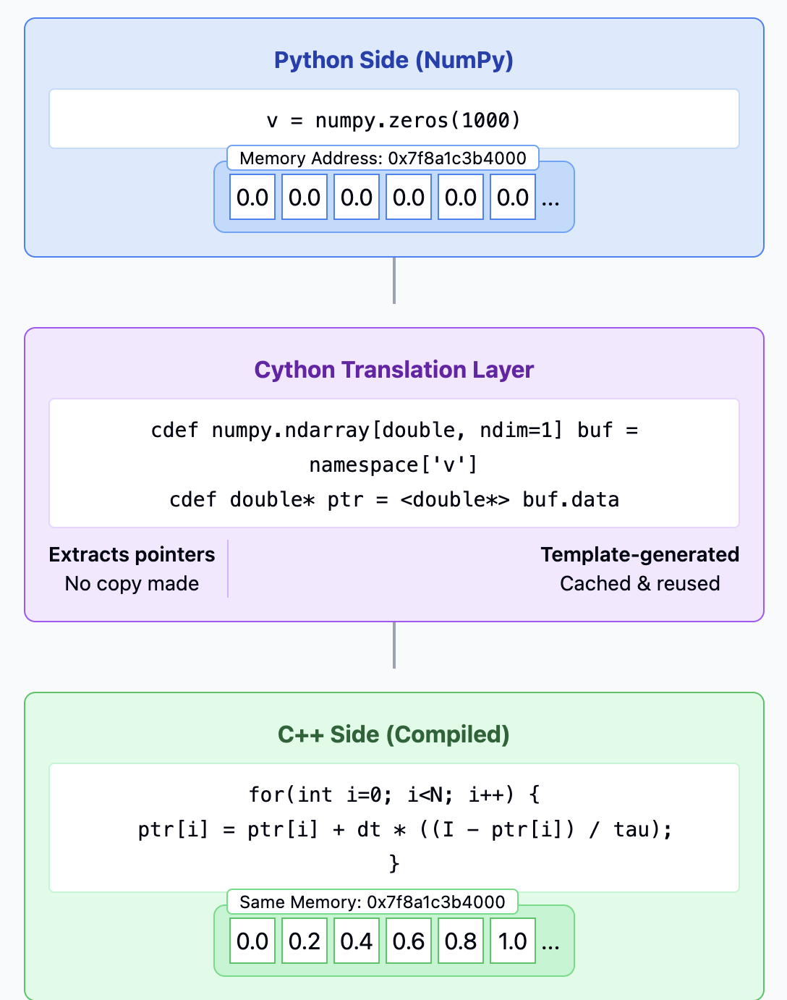
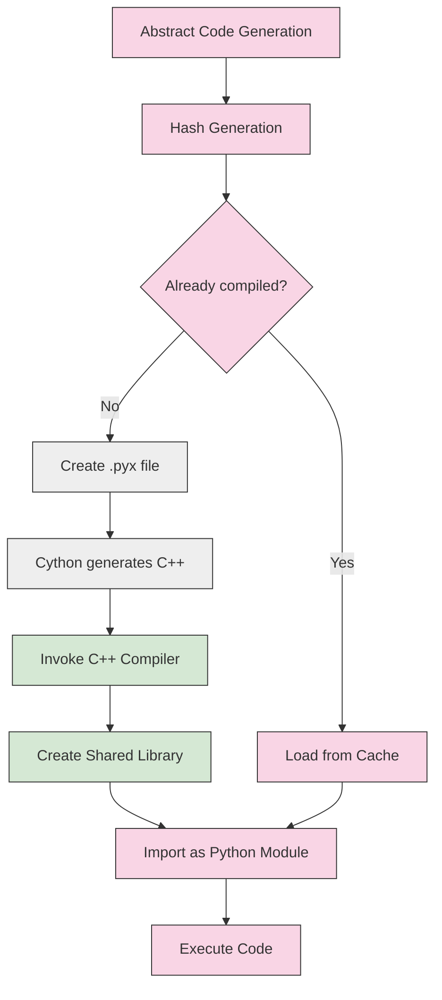
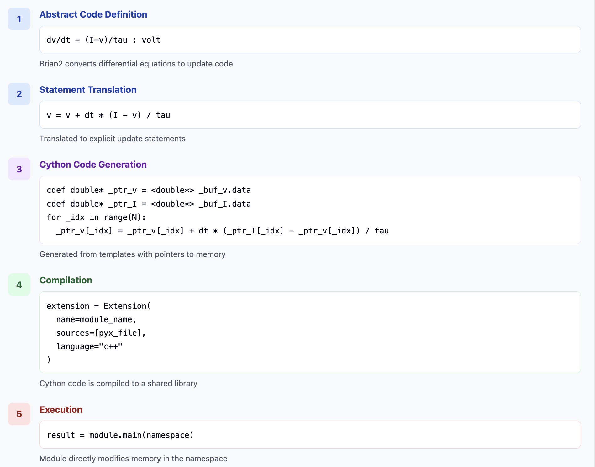
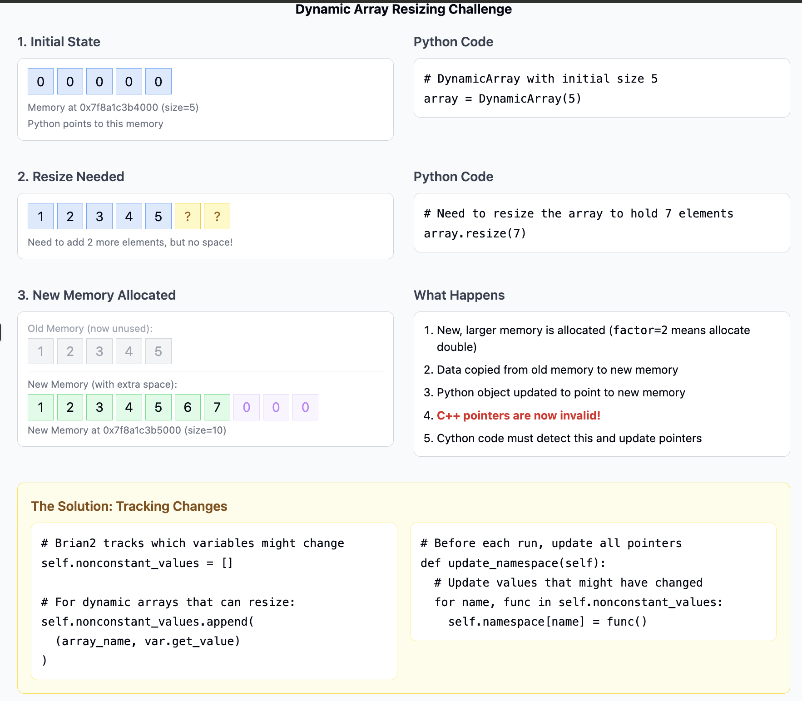
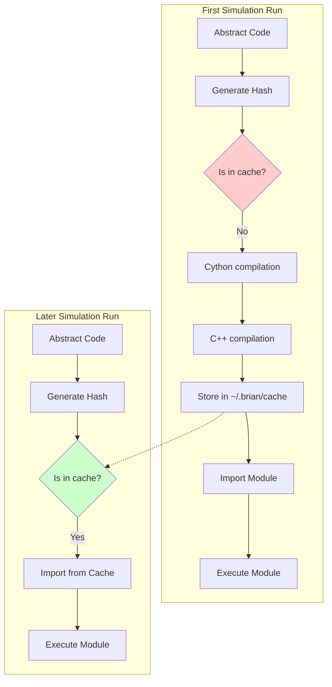

# Deep Dive into Brian2 Cython Integration: Memory Sharing Between Python and C++

I'm going to explain how Brian2 efficiently bridges Python and low-level C++ code through Cython, with a special focus on the memory sharing mechanisms that make it fast.

## The Problem: Simulating Neural Networks Efficiently

Neural simulations require processing large arrays of data with complex mathematical operations. Python is great for flexibility but slow for number crunching, while C++ is fast but less convenient to use. Brian2 brilliantly combines both worlds by sharing memory between Python and C++ code.

## Key Architecture Insight

The core insight is **zero-copy memory access**: Python and C++ code operate on the exact same memory, avoiding expensive data copying between languages.

## Visual Overview of the Code Generation Pipeline

```
┌─────────────────┐     ┌─────────────────┐     ┌───────────────────┐
│ Python          │     │ Cython          │     │ Compiled C++      │
│ - Model design  │     │ - Translation   │     │ - Fast execution  │
│ - Array creation│ ==> │ - Pointer       │ ==> │ - Direct memory   │
│ - NeuronGroups  │     │   extraction    │     │   manipulation    │
└─────────────────┘     └─────────────────┘     └───────────────────┘
```



## Building and Compiling Cython Modules



## The Memory Sharing Mechanism in Depth

Let's walk through exactly how Brian2 achieves this impressive memory sharing:

### 1. Creating NumPy Arrays in Python

Everything starts with the familiar Python/NumPy interface:

```python
# User creates a neuron group in Python
neurons = NeuronGroup(100, 'dv/dt = (I-v)/tau : volt')
```

Internally, Brian2 creates NumPy arrays for all variables (e.g., `v` and `I` in this example). These arrays exist in Python-accessible memory:

```python
# Internally, arrays are created for all variables
v = numpy.zeros(100, dtype=numpy.float64)
```

### 2. The Variables-to-Namespace System

Brian2 collects all variables into a "namespace" dictionary:

```python
namespace = {
    'v': v,     # The actual NumPy array for membrane potential
    'I': I,     # The current array
    'tau': tau  # Time constant
}
```

#### How Python to Cpp Memory Access Wroks

```python
# 1. PYTHON SIDE: Variables created and stored in namespace

# In Python, Brian2 creates all variables as NumPy arrays
v = numpy.zeros(1000, dtype=numpy.float64)  # Membrane potential
I = numpy.ones(1000, dtype=numpy.float64)  # Input current
tau = 10.0 * ms  # Time constant

# These variables are placed in a namespace dictionary
namespace = {
    'v': v,
    'I': I,
    'tau': tau
}


# 2. CYTHON TEMPLATE: Extract memory pointers

# This code is generated from a template in
# brian2/codegen/runtime/cython_rt/templates/common_group.pyx
"""
def main(_namespace):
    # Get the NumPy arrays from the namespace
    cdef _numpy.ndarray[double, ndim=1, mode='c'] _buf_v = _namespace['v']
    cdef _numpy.ndarray[double, ndim=1, mode='c'] _buf_I = _namespace['I']

    # Extract C pointers to the underlying memory buffers
    cdef double* _ptr_v = <double*> _buf_v.data
    cdef double* _ptr_I = <double*> _buf_I.data

    cdef double tau = _namespace['tau']

    # Now _ptr_v points directly to the memory of the NumPy array
"""


# 3. C++ EXECUTION: Work directly with memory

# The generated C++ code now can work directly with these
# memory locations without any copying:
"""
for(int _idx=0; _idx<1000; _idx++) {
    // Read values from raw memory
    double v_value = _ptr_v[_idx];
    double I_value = _ptr_I[_idx];

    // Compute the update
    _ptr_v[_idx] = v_value + dt * ((I_value - v_value) / tau);
}
"""

# 4. PYTHON SEES CHANGES IMMEDIATELY

# After C++ code execution, the NumPy arrays in Python
# already contain the updated values because they share
# the same memory locations
print(v)  # Shows values updated by C++ code
```

### 3. The Magic: The Cython Pointer Extraction

When the compiled code executes, Cython acts as the bridge:

```cython
def main(_namespace):
    # Extract arrays from the namespace
    cdef numpy.ndarray[double, ndim=1, mode='c'] _buf_v = _namespace['v']

    # Get direct C pointers to the memory
    cdef double* _ptr_v = <double*> _buf_v.data
```

This is where the real magic happens - Cython exposes the actual memory address of the NumPy array to C++. The `.data` attribute of a NumPy array points to its raw memory buffer, and Cython lets us cast this to a C pointer.

### 4. C++ Directly Manipulates Python Memory

The compiled C++ code now works directly with the raw memory:

```cpp
for(int i=0; i<N; i++) {
    // Direct memory access and manipulation
    ptr_v[i] = ptr_v[i] + dt * ((ptr_I[i] - ptr_v[i]) / tau);
}
```

No data copying happens between Python and C++. The C++ code modifies the exact same memory that Python's NumPy arrays are viewing.

## The Full Compilation Pipeline



When Brian2 generates code, it follows these steps:

1. **Template Selection**: Choose appropriate code templates based on the operation (state updates, threshold detection, etc.)

2. **Code Generation**: Using these templates, generate Cython code with:

   - Declarations of NumPy arrays
   - Extraction of pointers to the data
   - Actual computation code

3. **Hashing & Caching**: Generate a hash based on the code and Python environment to check if this code has already been compiled.

4. **Cython Compilation**: If not cached, compile the Cython code to C++ and then to a shared library.

5. **Module Loading**: Import the generated module.

6. **Execution**: Call the `main()` function of the module, passing the namespace dictionary.

## Handling Dynamic Data Structures

One of the most challenging aspects is handling dynamic data structures that can resize during simulation:



Brian2 cleverly solves the challenge of dynamic arrays that can resize during simulation by:

1. **Memory indirection**: Keeping an additional layer of indirection between Python's view and the actual memory
2. **Tracking changes**: Maintaining a list of variables that might change memory location
3. **Updating references**: Before each code object runs, the `update_namespace()` method ensures all pointer references are up to date


## Caching: A Critical Performance Enhancement

Brian2's compilation caching system is one of the key performance optimizations that makes the framework practical for everyday use. Without it, every simulation would need to recompile all its code objects, which could take minutes.



### How Brian2's Caching Works:

1. **Hash Generation**: Each piece of code is hashed based on:
   - The code itself
   - Python version
   - Cython version
   - NumPy version
   - Compiler details

2. **Cache Location**: Compiled modules are stored in a cache directory (default is in the user's home directory under `~/.brian/brian_extensions`)

3. **Module Reuse**: When running similar simulations, Brian2 can reuse previously compiled modules

The caching system is implemented in `extension_manager.py`, which creates a unique module name based on the hash:

```python
module_name = f"_cython_magic_{hashlib.md5(str(key).encode('utf-8')).hexdigest()}"
```


## Challenges of Zero-Copy Memory Sharing

While the zero-copy approach provides excellent performance, it introduces several technical challenges that Brian2 elegantly solves:

### 1. Memory Resizing

When arrays need to resize (e.g., when adding new synapses), the memory location changes. Brian2 handles this by:

- Using the `DynamicArray` class that oversizes allocations (using a growth factor, typically 2x)
- Tracking which arrays might resize using the `nonconstant_values` list
- Refreshing pointers before each code execution via `update_namespace()`

### 2. Memory Alignment

SIMD instructions require properly aligned memory. Brian2 ensures this by:

- Creating NumPy arrays with the `'c'` mode in Cython declarations:
  ```cython
  cdef _numpy.ndarray[double, ndim=1, mode='c'] _buf_v
  ```
- Careful alignment in memory allocation

### 3. Thread Safety

When using multithreading, memory access needs to be coordinated:

- Brian2 uses the `restrict` keyword in C++ to indicate non-overlapping memory regions
- This enables compiler optimizations like auto-vectorization
- Special handling for subgroups to ensure non-overlapping access


## Advanced Memory Optimizations

Brian2 implements several advanced memory optimizations that improve performance beyond the basic pointer extraction:

### 1. LazyArange for Efficient Indexing

For operations that would typically require a large array of indices, Brian2 uses a `LazyArange` class that behaves like a NumPy array but doesn't actually allocate memory until necessary:

```python
# Instead of creating a large array with np.arange(N)
_idx = LazyArange(N)
```

This is crucial for operations on very large networks, where creating index arrays would consume significant memory.

### 2. Loop-Invariant Code Motion

The code generator automatically detects expressions that don't change within vectorized loops and moves them outside:

```python
# Before optimization
v = v + dt * exp(-t/tau) * (I - v)

# After optimization
_lio_1 = exp(-t/tau)  # Loop invariant, computed once
v = v + dt * _lio_1 * (I - v)
```

This optimization is controlled by the `codegen.loop_invariant_optimisations` preference.

### 3. Arithmetic Simplifications

Brian2 automatically simplifies arithmetic expressions:

```python
# Before simplification
x = 0 * v  # Any value multiplied by zero is zero

# After simplification
x = 0.0  # Direct assignment, no multiplication needed
```
