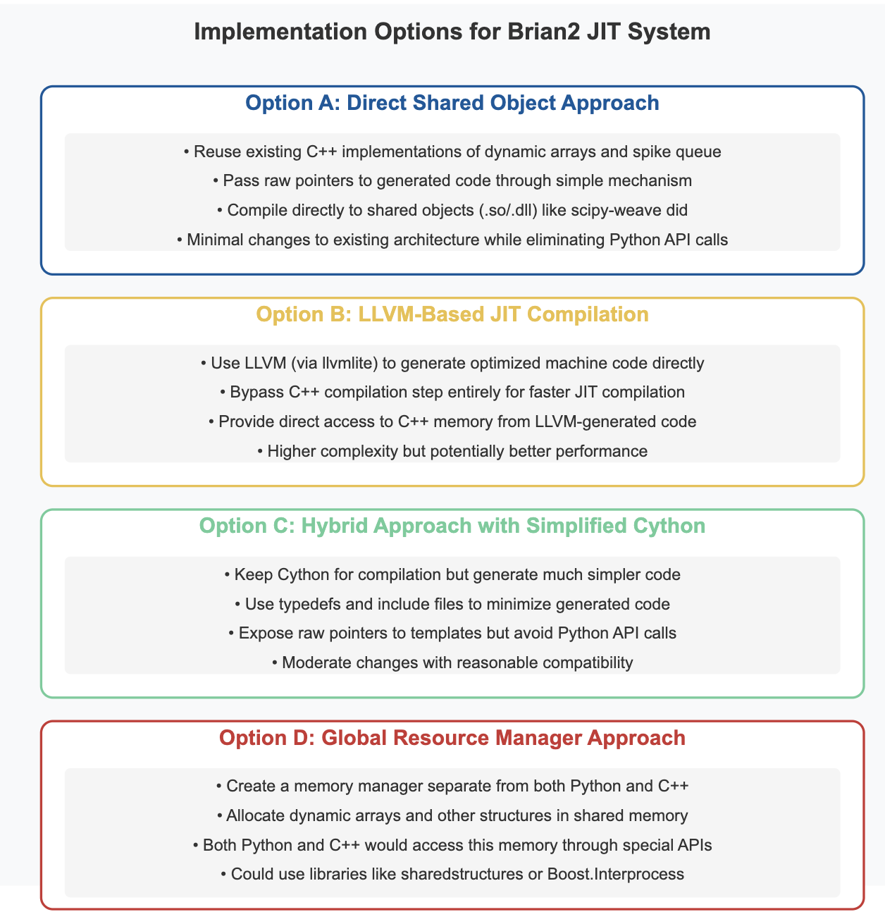

# Exploring Viable Implementation Paths for Brian2 Optimization

Based on my research—and the discovery that Brian2 already includes C++ implementations of key data structures—I have identified several promising approaches for optimizing its runtime performance. In this document, I analyze each option in depth to determine the most effective path forward for the GSoC project. This research is built upon studies of Cython, LLVM, and memory management techniques in high-performance computing.



## Option A: Direct Shared Object Approach

Inspired by [scipy-weave](https://github.com/scipy/scipy), this approach leverages existing C++ implementations and directly passes raw pointers to the generated code. This method bypasses much of the Python API overhead and eliminates the need for Cython during execution.

```python
def create_runner_codeobj(group, code, ...):
    # Collect raw pointers to C++ data from dynamic arrays
    raw_pointers = {
        name: var.get_value().get_raw_pointer()
        for name, var in variables.items()
        if hasattr(var.get_value(), 'get_raw_pointer')
    }

    # Generate C++ code with direct pointer access
    cpp_code = generate_cpp_code(code, raw_pointers)

    # Compile to a shared object (.so or .dll)
    compile_cpp_to_so(cpp_code)

    # Load and return callable function
    return load_shared_object()
```

### Advantages

- **Minimal Architectural Changes**: Integrates smoothly with the existing Brian2 framework.
- **Eliminates Python API Overhead**: Direct memory access via raw pointers.
- **Removes Cython Dependency**: Avoids additional compilation layers during simulation.
- **Clean and Maintainable**: Leverages existing, well-tested C++ implementations.

### Challenges

- **Compilation Overhead**: Recompilation is required for each code change, which may slow down iterative development.
- **Cross-Platform Compatibility**: Shared object management may vary across operating systems.
- **Debugging Complexity**: Debugging lower-level C++ code can be more challenging compared to Python.

While researching this approach, I found that scientific computing libraries like [Numba](https://numba.pydata.org/) use similar techniques to generate efficient machine code. In particular, I was inspired by how [PyTorch's C++ extensions](https://pytorch.org/tutorials/advanced/cpp_extension.html) handle memory sharing between Python and C++.

## Option B: LLVM-Based JIT Compilation

Using LLVM through tools like [llvmlite](https://llvmlite.readthedocs.io/en/latest/) could allow Brian2 to generate optimized machine code directly at runtime. This method bypasses the traditional C++ compilation step, providing a modern and flexible JIT environment.

### Advantages

- **Faster Compilation Times**: JIT compilation can be much quicker than traditional C++ compilation.
- **Fine-Grained Optimization**: LLVM allows for aggressive and detailed code optimizations.
- **Modern and Flexible**: Leverages the latest advancements in JIT compilation and dynamic code generation.

### Challenges

- **High Implementation Complexity**: Requires deep understanding of LLVM's Intermediate Representation (IR) and JIT internals.
- **Debugging Difficulty**: Generated machine code is more challenging to debug.
- **Template Adaptation**: Converting existing Cython/C++ templates to LLVM IR can be nontrivial.
- **Maintenance Burden**: The LLVM stack requires specialized expertise for long-term maintenance.

I've spent considerable time studying how [Julia language](https://julialang.org/blog/2020/08/julia-1.5-highlights/) implements its LLVM-based JIT compiler and how [Numba's LLVM pipeline](https://numba.readthedocs.io/en/stable/developer/architecture.html#introduction) works. The approach has proven successful in high-performance scientific computing, but the implementation complexity is significant.

## Option C: Hybrid Approach with Simplified Cython

This approach maintains the familiar Cython-based compilation pipeline while generating leaner, more optimized code. By minimizing unnecessary boilerplate and focusing on direct pointer access, this method seeks to improve performance without a radical shift away from current infrastructure.

```cython
# Template header with minimal imports and optimizations

#cython: language_level=3
#cython: boundscheck=False
#cython: wraparound=False
#cython: cdivision=True
#cython: nonecheck=False

cdef extern from "brian_types.h":
    ctypedef double* DoublePtr
    ctypedef int* IntPtr
    # Additional typedefs as required

def main(raw_ptrs):
    # Cast raw integer pointers to typed pointers
    cdef DoublePtr v_ptr = <DoublePtr>raw_ptrs['v']
    cdef DoublePtr I_ptr = <DoublePtr>raw_ptrs['I']

    # Direct memory access loop
    for i in range(N):
        v_ptr[i] = v_ptr[i] + dt * ((I_ptr[i] - v_ptr[i]) / tau_ptr[i])

```

### Advantages

- **Incremental Improvement**: Enhances the existing Cython framework without a complete overhaul.
- **Easier Implementation**: More manageable changes compared to a full C++ backend switch.
- **Maintainability**: Keeps the technology stack familiar to the Brian2 team.
- **Clear Debugging**: Generates human-readable intermediate C++ code for debugging.

### Challenges

- **Limited Optimization Potential**: May not achieve the highest possible performance gains.
- **Cython Dependency Remains**: Still relies on the Cython compilation process.
- **Template Complexity**: Requires significant modifications to the existing template system.

The [Cython optimization guide](https://cython.readthedocs.io/en/latest/src/tutorial/cython_tutorial.html) provided valuable insights on reducing Python API calls while maintaining code readability.

## Option D: Global Resource Manager

This approach introduces a central manager that abstracts memory ownership, removing the need for either Python or C++ to exclusively own the memory. Such a manager would oversee dynamic memory allocation and synchronization across both languages.

### Advantages

- **Clean Separation of Concerns**: Provides a unified interface for memory management.
- **Advanced Memory Handling**: Potential to implement sophisticated memory allocation and garbage collection strategies.
- **Multi-Process Capabilities**: Could enable parallel or distributed processing by sharing memory across processes.
- **Well-Defined Interfaces**: Clear API for both Python and C++ interactions.

### Challenges

- **Architectural Overhaul**: Requires a fundamental redesign of the memory management layer in Brian2.
- **Implementation Complexity**: Managing shared memory safely and efficiently is challenging.
- **Performance Overhead**: Additional abstraction layers may introduce performance penalties.
- **Debugging Complexity**: Added indirection can make troubleshooting more difficult.

My research into shared memory approaches led me to study systems like [Apache Arrow](https://arrow.apache.org/docs/python/memory.html) and [Boost.Interprocess](https://www.boost.org/doc/libs/1_75_0/doc/html/interprocess.html). I also looked at how modern Python scientific libraries like [Dask](https://docs.dask.org/en/latest/array.html) handle distributed memory management.

## Recommended Path Forward

After weighing the technical advantages and challenges of each approach, I recommend a **hybrid strategy combining Option A (Direct Shared Object)** and **Option C (Simplified Cython)**. This approach offers a balance between immediate performance improvements and a clear path toward more extensive architectural changes.

### Implementation Plan:

1. **Initial Phase**:

   - Implement the simplified Cython approach to establish direct pointer access.
   - Focus on reducing Python API calls within the inner loop.
   - Benchmark performance improvements and ensure compatibility with existing Brian2 code.

2. **Second Phase**:
   - Transition gradually toward the direct shared object approach once the pointer access mechanism is robust.
   - Work on reducing compilation overhead by caching compiled shared objects.
   - Optimize cross-platform compatibility and streamline the debugging process.

I've taken inspiration from how [TensorFlow](https://www.tensorflow.org/guide/function) implemented its XLA compiler, starting with a simplified approach and gradually evolving toward more sophisticated compilation strategies. The [scikit-learn](https://scikit-learn.org/stable/developers/performance.html) performance optimization guide was also influential in shaping this incremental approach.

### Benefits:

- **Incremental Improvement**: Measurable progress at each stage, reducing risk.
- **Risk Mitigation**: Limits the scope of changes at any one phase.
- **Backward Compatibility**: Maintains compatibility with existing Brian2 modules.
- **Significant Performance Gains**: Immediate improvements in runtime performance by eliminating Python API overhead.

## Implementation Sketch

After studying Brian2's codebase in detail, particularly the [code generation pipeline](https://brian2.readthedocs.io/en/stable/developer/guidelines/codegen.html), I've sketched out how the hybrid approach might look:

1. **Extend DynamicArray class**:

   ```python
   def get_raw_pointer(self):
       """Return the raw pointer to the underlying C++ array."""
       if self._use_cpp:
           return self._cpp_array.get_raw_pointer()
       return None
   ```

2. **Modify CodeGenerator to collect pointer information**:

   ```python
   def collect_pointers(self, variables):
       """Collect raw pointers to C++ arrays."""
       pointers = {}
       for name, var in variables.items():
           if hasattr(var, 'get_value'):
               value = var.get_value()
               if hasattr(value, 'get_raw_pointer'):
                   pointer = value.get_raw_pointer()
                   if pointer is not None:
                       pointers[name] = pointer
       return pointers
   ```

3. **Update Cython templates to use raw pointers**:
   ```cython
   # Modified template with direct pointer access
   
   cdef {{ cpp_dtype(var.dtype) }}* _ptr_{{ name }} = <{{ cpp_dtype(var.dtype) }}*>{{ pointers[name] }}
   
   # Fall back to regular array access
   cdef {{ cpp_dtype(var.dtype) }}* _ptr_{{ name }} = {{ get_array_name(var) }}
   
   ```

## Conclusion

In summary, while each option offers unique advantages and challenges, the recommended hybrid strategy allows us to leverage the best aspects of both direct C++ integration and a streamlined Cython pipeline. This research forms a solid technical foundation for my GSoC project proposal, addressing the core challenge of eliminating Python API calls in the simulation's inner loop while ensuring the robustness and maintainability of Brian2.

The successful implementation of this approach could have a significant impact beyond Brian2, potentially benefiting other scientific computing libraries that face similar Python/C++ integration challenges. I'm excited about the potential to contribute to the broader scientific Python ecosystem through this work.
